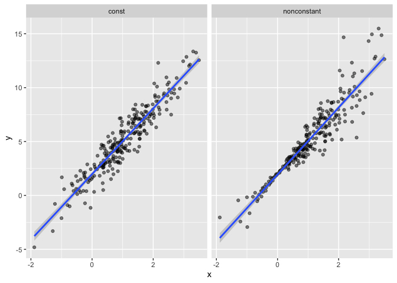
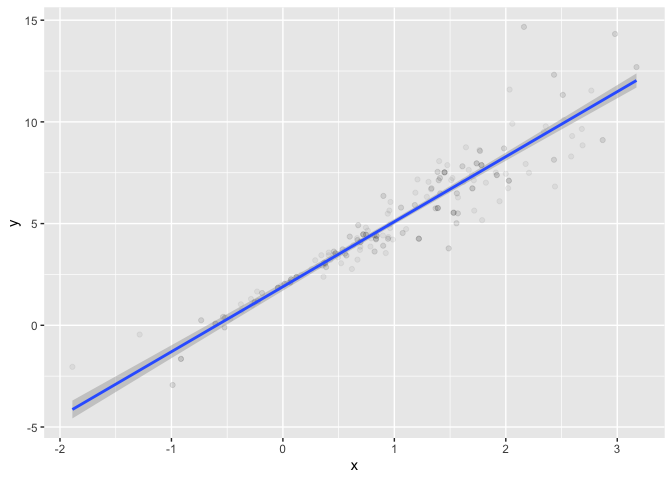
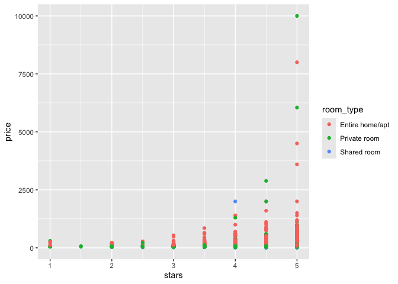

Bootstrapping
================

this is the repository for bootstrapping of P8105

``` r
library(tidyverse)
```

    ## ── Attaching core tidyverse packages ──────────────────────── tidyverse 2.0.0 ──
    ## ✔ dplyr     1.1.4     ✔ readr     2.1.5
    ## ✔ forcats   1.0.0     ✔ stringr   1.5.1
    ## ✔ ggplot2   3.5.1     ✔ tibble    3.2.1
    ## ✔ lubridate 1.9.3     ✔ tidyr     1.3.1
    ## ✔ purrr     1.0.2     
    ## ── Conflicts ────────────────────────────────────────── tidyverse_conflicts() ──
    ## ✖ dplyr::filter() masks stats::filter()
    ## ✖ dplyr::lag()    masks stats::lag()
    ## ℹ Use the conflicted package (<http://conflicted.r-lib.org/>) to force all conflicts to become errors

``` r
library(modelr)
library(p8105.datasets)

set.seed(1)
```

do some bootstrapping make up some data

``` r
n_samp = 250

sim_df_constant = 
  tibble(
    x=rnorm(n_samp, 1,1),
    error=rnorm(n_samp, 0,1),
    y=2+3*x+error
  )

sim_df_nonconstant = sim_df_constant |> 
  mutate(
  error = error * .75 * x,
  y = 2 + 3 * x + error
)
```

lets look at these

``` r
sim_df = 
  bind_rows(const = sim_df_constant, nonconstant = sim_df_nonconstant, .id = "data_source") 

sim_df |> 
  ggplot(aes(x = x, y = y)) + 
  geom_point(alpha = .5) +
  stat_smooth(method = "lm") +
  facet_grid(~data_source) 
```

    ## `geom_smooth()` using formula = 'y ~ x'

<!-- -->

Look at regression results

``` r
lm(y ~ x, data = sim_df_constant) |> 
  broom::tidy() |> 
  knitr::kable(digits = 3)
```

| term        | estimate | std.error | statistic | p.value |
|:------------|---------:|----------:|----------:|--------:|
| (Intercept) |    1.977 |     0.098 |    20.157 |       0 |
| x           |    3.045 |     0.070 |    43.537 |       0 |

## Draw a bootstrap sample

``` r
boot_sample = function(df){
  
  boot_df =
    sample_frac(df, replace=TRUE) |>
    arrange(x)
  
  return(boot_df)
}
```

lets try running this

``` r
sim_df_nonconstant |>
  boot_sample() |>
  ggplot(aes (x=x, y=y)) +
  geom_point(alpha=0.05)+
  stat_smooth(method = "lm")
```

    ## `geom_smooth()` using formula = 'y ~ x'

<!-- -->

can we do this part of an analysis?

``` r
sim_df_nonconstant |>
  boot_sample() |>
  lm(y~x, data = _)|>
  broom::tidy()|>
  knitr::kable(digits =3)
```

| term        | estimate | std.error | statistic | p.value |
|:------------|---------:|----------:|----------:|--------:|
| (Intercept) |    1.896 |     0.098 |    19.311 |       0 |
| x           |    3.142 |     0.069 |    45.636 |       0 |

## Boostrap a lot

``` r
boot_straps = 
  tibble(
    strap_number = 1:1000,
    ) |> 
  mutate(
    strap_sample = map(strap_number, \(i) boot_sample(df = sim_df_nonconstant)),
    models = map(strap_sample, \(strap_df) lm(y~x, data=strap_df)),
    results = map(models, broom::tidy)
  )

boot_results =
  boot_straps |>
  select(strap_number, results) |>
  unnest(results)|>
  group_by(term) |>
  summarize(
    boot_se = sd(estimate)
  )
```

## Using modelr

``` r
boot_straps =
  sim_df_nonconstant |>
  modelr::bootstrap(1000) |>
  mutate(
    strap = map(strap, as_tibble),
    models = map(strap, \(df) lm(y~x, data=df)),
    results = map(models, broom::tidy)
  ) |>
  select(.id, results)|>
  unnest(results)
```

``` r
boot_straps |> 
  group_by(term) |> 
  summarize(
    ci_lower = quantile(estimate, 0.025), 
    ci_upper = quantile(estimate, 0.975))
```

    ## # A tibble: 2 × 3
    ##   term        ci_lower ci_upper
    ##   <chr>          <dbl>    <dbl>
    ## 1 (Intercept)     1.79     2.08
    ## 2 x               2.92     3.32

## Airbnb

``` r
data("nyc_airbnb")

nyc_airbnb = 
  nyc_airbnb |> 
  mutate(stars = review_scores_location / 2) |> 
  rename(
    borough = neighbourhood_group,
    neighborhood = neighbourhood) |> 
  filter(borough != "Manhattan") |> 
  drop_na(price, stars) |> 
  select(price, stars, borough, neighborhood, room_type)
```

``` r
nyc_airbnb |> 
  ggplot(aes(x = stars, y = price, color = room_type)) + 
  geom_point() 
```

<!-- -->
