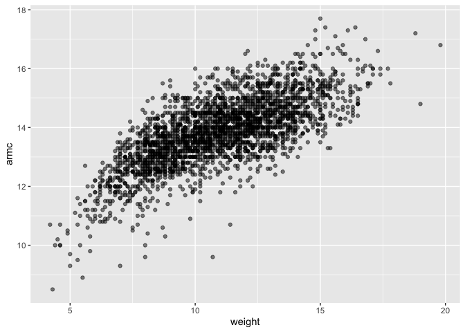
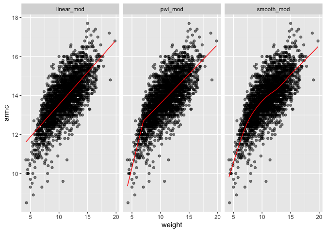

Cross Validation
================

this is the repository for cross validation

``` r
library(tidyverse)
library(modelr)
library(mgcv)
```

``` r
library(SemiPar)

set.seed(1)
```

``` r
data(lidar)

lidar_df = 
  lidar |> 
  as_tibble() |>
  mutate(id = row_number())

lidar_df |> 
  ggplot(aes(x = range, y = logratio)) + 
  geom_point()
```

<!-- -->

Imports data that is non-linear model and shows increasing variance as
the predictor increases

``` r
train_df = sample_frac(lidar_df, size = .8)
test_df = anti_join(lidar_df, train_df, by = "id")

ggplot(train_df, aes(x = range, y = logratio)) + 
  geom_point() + 
  geom_point(data = test_df, color = "red")
```

<!-- -->

``` r
linear_mod = lm(logratio ~ range, data = train_df)
smooth_mod = mgcv::gam(logratio ~ s(range), data = train_df)
wiggly_mod = mgcv::gam(logratio ~ s(range, k = 30), sp = 10e-6, data = train_df)
```

Putting smooth lines through data clouds, and we can control how smooth
we want the fit to be.

``` r
train_df |> 
  add_predictions(smooth_mod) |> 
  ggplot(aes(x = range, y = logratio)) + 
  geom_point() + 
  geom_line(aes(y = pred), color = "red")
```

<!-- -->

``` r
train_df |> 
  add_predictions(wiggly_mod) |> 
  ggplot(aes(x = range, y = logratio)) + 
  geom_point() + 
  geom_line(aes(y = pred), color = "red")
```

<!-- -->

Adding redictions for several models to a data frame and then “pivoting”
so the result is a tidy, “long” dataset

``` r
train_df |> 
  gather_predictions(linear_mod, smooth_mod, wiggly_mod) |> 
  mutate(model = fct_inorder(model)) |> 
  ggplot(aes(x = range, y = logratio)) + 
  geom_point() + 
  geom_line(aes(y = pred), color = "red") + 
  facet_wrap(~model)
```

<!-- -->

## CV using modelr

``` r
cv_df = 
  crossv_mc(lidar_df, 100) 
```

``` r
cv_df |> pull(train) |> nth(1) |> as_tibble()
```

    ## # A tibble: 176 × 3
    ##    range logratio    id
    ##    <int>    <dbl> <int>
    ##  1   390  -0.0504     1
    ##  2   394  -0.0510     4
    ##  3   396  -0.0599     5
    ##  4   399  -0.0596     7
    ##  5   400  -0.0399     8
    ##  6   402  -0.0294     9
    ##  7   403  -0.0395    10
    ##  8   405  -0.0476    11
    ##  9   406  -0.0604    12
    ## 10   408  -0.0312    13
    ## # ℹ 166 more rows

``` r
cv_df =
  cv_df |> 
  mutate(
    train = map(train, as_tibble),
    test = map(test, as_tibble))
```

``` r
cv_df = 
  cv_df |> 
  mutate(
    linear_mod  = map(train, \(df) lm(logratio ~ range, data = df)),
    smooth_mod  = map(train, \(df) gam(logratio ~ s(range), data = df)),
    wiggly_mod  = map(train, \(df) gam(logratio ~ s(range, k = 30), sp = 10e-6, data = df))) |> 
  mutate(
    rmse_linear = map2_dbl(linear_mod, test, \(mod, df) rmse(model = mod, data = df)),
    rmse_smooth = map2_dbl(smooth_mod, test, \(mod, df) rmse(model = mod, data = df)),
    rmse_wiggly = map2_dbl(wiggly_mod, test, \(mod, df) rmse(model = mod, data = df)))
```

``` r
cv_df |> 
  select(starts_with("rmse")) |> 
  pivot_longer(
    everything(),
    names_to = "model", 
    values_to = "rmse",
    names_prefix = "rmse_") |> 
  mutate(model = fct_inorder(model)) |> 
  ggplot(aes(x = model, y = rmse)) + geom_violin()
```

<!-- -->

## Child Growth

``` r
child_growth = read_csv("./data/nepalese_children.csv")
```

    ## Rows: 2705 Columns: 5
    ## ── Column specification ────────────────────────────────────────────────────────
    ## Delimiter: ","
    ## dbl (5): age, sex, weight, height, armc
    ## 
    ## ℹ Use `spec()` to retrieve the full column specification for this data.
    ## ℹ Specify the column types or set `show_col_types = FALSE` to quiet this message.

``` r
child_growth |> 
  ggplot(aes(x = weight, y = armc)) + 
  geom_point(alpha = .5)
```

<!-- -->

``` r
child_growth =
  child_growth |> 
  mutate(weight_cp7 = (weight > 7) * (weight - 7))
```

``` r
linear_mod = lm(armc ~ weight, data = child_growth)
pwl_mod    = lm(armc ~ weight + weight_cp7, data = child_growth)
smooth_mod = gam(armc ~ s(weight), data = child_growth)
```

``` r
child_growth |> 
  gather_predictions(linear_mod, pwl_mod, smooth_mod) |> 
  mutate(model = fct_inorder(model)) |> 
  ggplot(aes(x = weight, y = armc)) + 
  geom_point(alpha = .5) +
  geom_line(aes(y = pred), color = "red") + 
  facet_grid(~model)
```

<!-- -->

``` r
cv_df =
  crossv_mc(child_growth, 100) |> 
  mutate(
    train = map(train, as_tibble),
    test = map(test, as_tibble))
```

``` r
cv_df = 
  cv_df |> 
  mutate(
    linear_mod  = map(train, \(df) lm(armc ~ weight, data = df)),
    pwl_mod     = map(train, \(df) lm(armc ~ weight + weight_cp7, data = df)),
    smooth_mod  = map(train, \(df) gam(armc ~ s(weight), data = as_tibble(df)))) |> 
  mutate(
    rmse_linear = map2_dbl(linear_mod, test, \(mod, df) rmse(model = mod, data = df)),
    rmse_pwl    = map2_dbl(pwl_mod, test, \(mod, df) rmse(model = mod, data = df)),
    rmse_smooth = map2_dbl(smooth_mod, test, \(mod, df) rmse(model = mod, data = df)))
```

``` r
cv_df |> 
  select(starts_with("rmse")) |> 
  pivot_longer(
    everything(),
    names_to = "model", 
    values_to = "rmse",
    names_prefix = "rmse_") |> 
  mutate(model = fct_inorder(model)) |> 
  ggplot(aes(x = model, y = rmse)) + geom_violin()
```

<!-- -->
