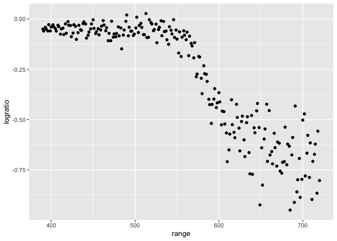
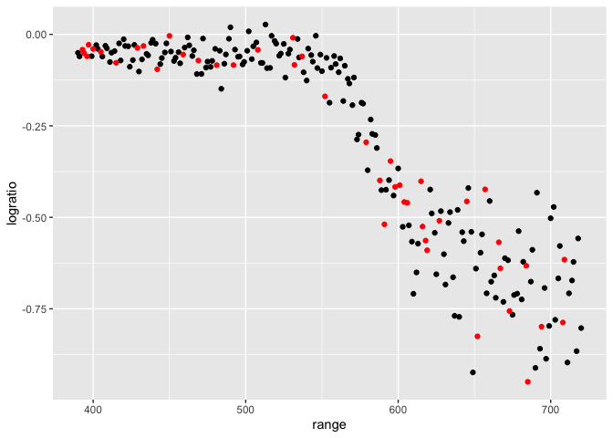

Cross Validation
================

this is the repository for cross validation

``` r
library(tidyverse)
library(modelr)
library(mgcv)
```

``` r
library(SemiPar)

set.seed(1)
```

``` r
data(lidar)

lidar_df = 
  lidar |> 
  as_tibble() |>
  mutate(id = row_number())

lidar_df |> 
  ggplot(aes(x = range, y = logratio)) + 
  geom_point()
```

<!-- -->

Imports data that is non-linear model and shows increasing variance as
the predictor increases

``` r
train_df = sample_frac(lidar_df, size = .8)
test_df = anti_join(lidar_df, train_df, by = "id")

ggplot(train_df, aes(x = range, y = logratio)) + 
  geom_point() + 
  geom_point(data = test_df, color = "red")
```

<!-- -->

``` r
linear_mod = lm(logratio ~ range, data = train_df)
smooth_mod = mgcv::gam(logratio ~ s(range), data = train_df)
wiggly_mod = mgcv::gam(logratio ~ s(range, k = 30), sp = 10e-6, data = train_df)
```

Putting smooth lines through data clouds, and we can control how smooth
we want the fit to be.

``` r
train_df |> 
  add_predictions(smooth_mod) |> 
  ggplot(aes(x = range, y = logratio)) + 
  geom_point() + 
  geom_line(aes(y = pred), color = "red")
```

<!-- -->

``` r
train_df |> 
  add_predictions(wiggly_mod) |> 
  ggplot(aes(x = range, y = logratio)) + 
  geom_point() + 
  geom_line(aes(y = pred), color = "red")
```

<!-- -->

Adding redictions for several models to a data frame and then “pivoting”
so the result is a tidy, “long” dataset

``` r
train_df |> 
  gather_predictions(linear_mod, smooth_mod, wiggly_mod) |> 
  mutate(model = fct_inorder(model)) |> 
  ggplot(aes(x = range, y = logratio)) + 
  geom_point() + 
  geom_line(aes(y = pred), color = "red") + 
  facet_wrap(~model)
```

<!-- -->
